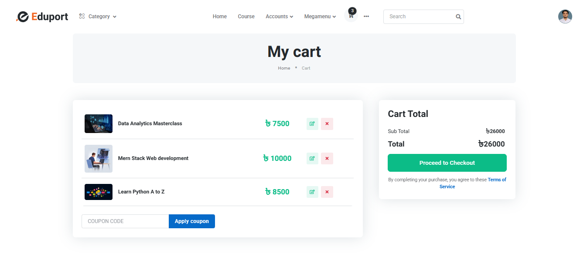
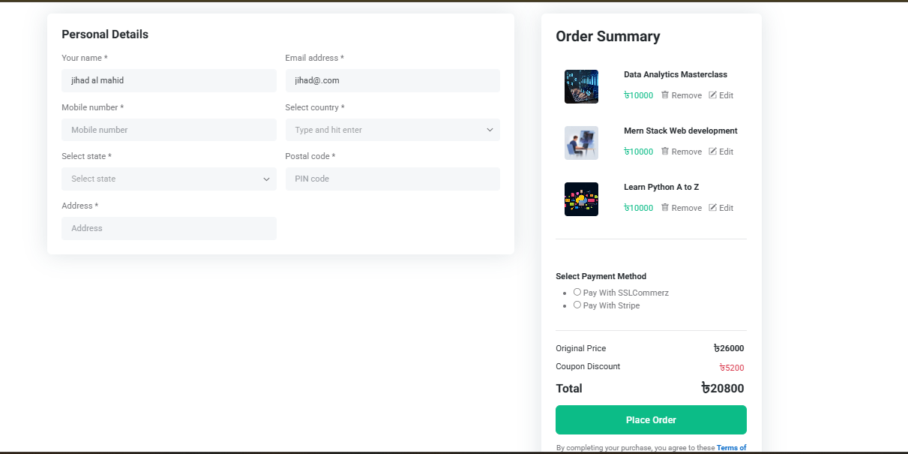
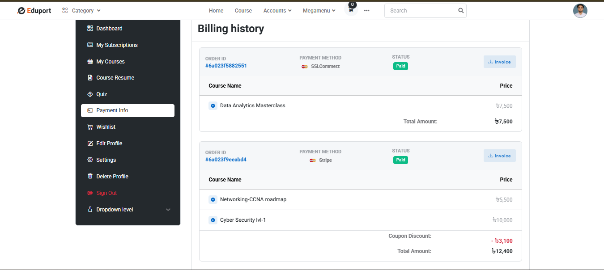

# 🎓 LMS — Learning Management System


> A full-featured web-based Learning Management System built with Laravel. Students can browse courses, enroll, manage their cart, apply coupons, checkout with SSLCommerz & Stripe, and track their billing history.

---

## 📸 Screenshots

### 🏠 Homepage


### 📚 Course List


### 🛒 Cart


### 💳 Checkout


### 👤 Edit Profile


### 🧾 Billing History


---

## ✨ Features

### 👨‍🎓 Student Panel
- ✅ Student Registration & Login
- ✅ Custom Student Guard Authentication
- ✅ Student Dashboard
- ✅ Profile Update (Name, Email, Username, Phone, Location, Education)
- ✅ Profile Picture Upload with Image Processing
- ✅ Password Update with Current Password Verification

### 📚 Course Management
- ✅ Course Browsing & Filtering
- ✅ Course Details with Instructor Info
- ✅ Course Level, Language & Category
- ✅ Course Progress Tracking
- ✅ Quiz System

### 🛒 Cart & Checkout
- ✅ Add to Cart
- ✅ Remove from Cart
- ✅ Coupon Code with Expiry Validation
- ✅ Discount Price Calculation
- ✅ Sub Total & Total Calculation
- ✅ Country & City Dynamic Dropdown (Ajax)
- ✅ SSLCommerz Payment Gateway
- ✅ Stripe Payment Gateway
- ✅ Order Success / Failed / Cancel Handling

### 🧾 Billing History
- ✅ Order ID Tracking
- ✅ Payment Method (SSLCommerz / Stripe)
- ✅ Course wise Price Breakdown
- ✅ Coupon Discount Display
- ✅ Total Amount per Order
- ✅ Invoice Download

### 🔐 Authentication & Security
- ✅ Custom Guard for Student
- ✅ Middleware Protected Routes
- ✅ Password Hashing with bcrypt
- ✅ Session Management
- ✅ Form Validation with Error Messages
- ✅ CSRF Protection

---

## 🛠️ Tech Stack


---

## ⚙️ Installation

```bash
# Repository clone করুন
git clone https://github.com/mahid36/LMS--learning-management-system.git

# Project folder এ যান
cd LMS--learning-management-system

# Dependencies install করুন
composer install
npm install

# .env file setup করুন
cp .env.example .env
php artisan key:generate

# Database migrate করুন
php artisan migrate

# Server run করুন
php artisan serve
```

---

## 💳 Payment Setup

**.env এ add করুন:**
```env
# SSLCommerz
SSLCZ_STORE_ID=your_store_id
SSLCZ_STORE_PASSWORD=your_store_password
SSLCZ_TEST_MODE=true

# Stripe
STRIPE_KEY=your_stripe_key
STRIPE_SECRET=your_stripe_secret
```

---

## 🗂️ Project Structure

```
├── app/
│   ├── Http/Controllers/
│   │   ├── StudentController.php
│   │   ├── CartController.php
│   │   ├── CheckoutController.php
│   │   ├── CouponController.php
│   ├── Models/
│   │   ├── Student.php
│   │   ├── Course.php
│   │   ├── Cart.php
│   │   ├── Order.php
│   │   ├── OrderProduct.php
├── resources/
│   ├── views/
│   │   ├── frontend/
│   │   │   ├── student/
├── routes/
│   ├── web.php
├── screenshots/
└── README.md
```

---

## 🤝 Contributing

Pull requests are welcome! For major changes, please open an issue first.

---

## 📄 License

This project is open source and available under the [MIT License](LICENSE).

---

## 👨‍💻 Author

**Jihad Al Mahid**


[](https://github.com/mahid36)

<details>
<summary>📸 View More Screenshots</summary>


</details>
