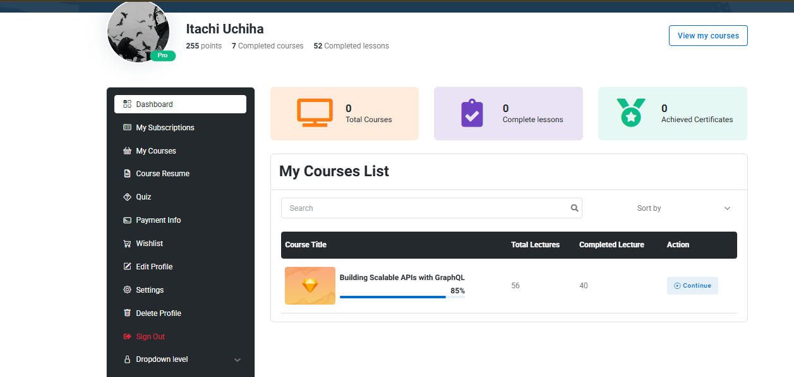
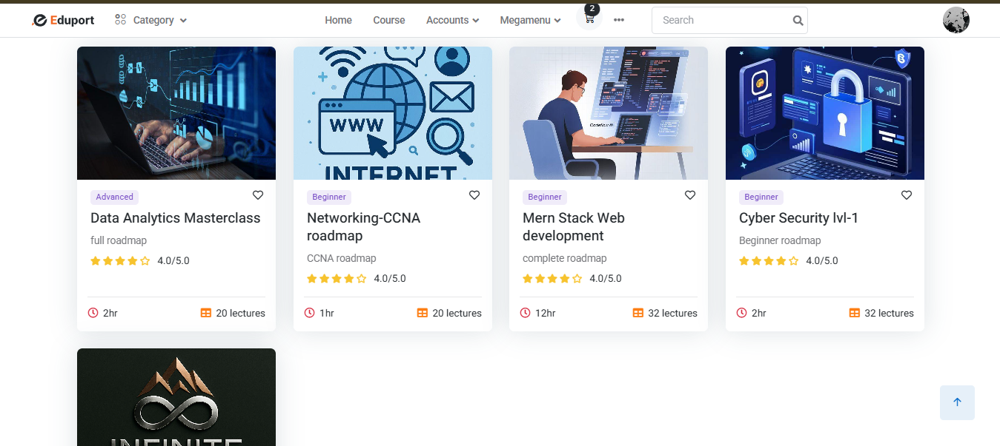
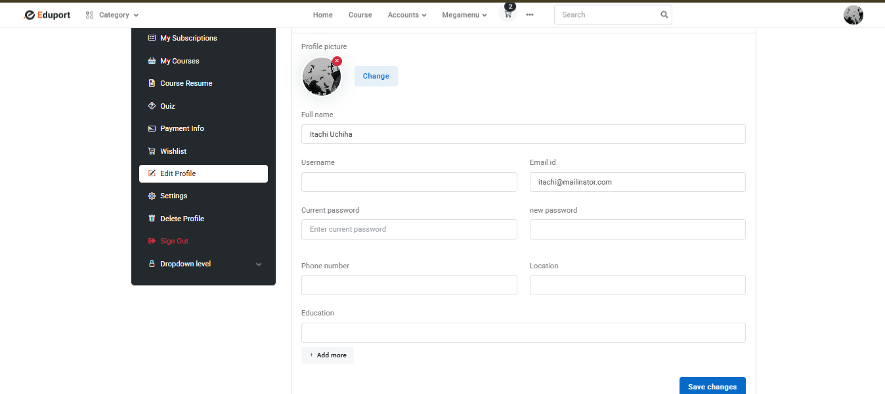

# 🎓 LMS — Learning Management System


> A web-based Learning Management System for managing courses, students, instructors, and assessments efficiently. Built with Laravel for scalable and interactive e-learning experiences.

---

## 📸 Screenshots

### 🏠 Homepage


### 🎓 Student Dashboard


### 📚 Course List


### 👤 Edit Profile


### 👤 Edit Profile


---

## ✨ Features

### 👨‍🎓 Student Panel
- ✅ Student Registration & Login
- ✅ Custom Student Guard Authentication
- ✅ Student Dashboard
- ✅ Profile Update (Name, Email, Username, Phone, Location, Education)
- ✅ Profile Picture Upload
- ✅ Password Update with Current Password Verification
- ✅ My Courses List with Progress Bar
- ✅ Payment Info / Billing History
- ✅ Wishlist
- ✅ Course Resume

### 📚 Course Management
- ✅ Course Browsing
- ✅ Course Details
- ✅ Course Progress Tracking
- ✅ Quiz System

### 🔐 Authentication & Security
- ✅ Custom Guard for Student
- ✅ Middleware Protected Routes
- ✅ Password Hashing with bcrypt
- ✅ Session Management
- ✅ Form Validation with Error Messages

---

## 🛠️ Tech Stack


---

## ⚙️ Installation

```bash
# Repository clone করুন
git clone https://github.com/mahid36/LMS--learning-management-system.git

# Project folder এ যান
cd LMS--learning-management-system

# Dependencies install করুন
composer install
npm install

# .env file setup করুন
cp .env.example .env
php artisan key:generate

# Database migrate করুন
php artisan migrate

# Server run করুন
php artisan serve
```

---

## 🗂️ Project Structure

```
├── app/
│   ├── Http/Controllers/
│   ├── Models/
│       ├── Student.php
├── resources/
│   ├── views/
│   │   ├── frontend/
│   │   │   ├── student/
│   │   │   │   ├── dashboard.blade.php
│   │   │   │   ├── edit-profile.blade.php
│   │   │   │   ├── course-list.blade.php
├── routes/
│   ├── web.php
├── screenshots/
└── README.md
```

---

## 🤝 Contributing

Pull requests are welcome! For major changes, please open an issue first.

---

## 📄 License

This project is open source and available under the [MIT License](LICENSE).

---

## 👨‍💻 Author

**Mahid**
[](https://github.com/mahid36)
